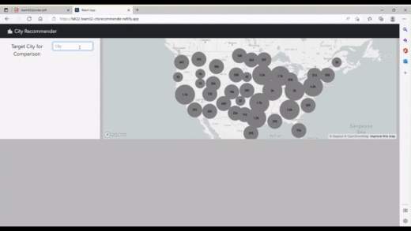
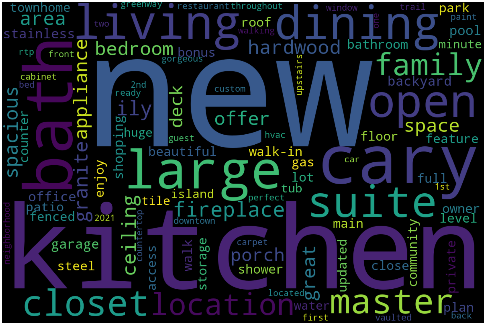
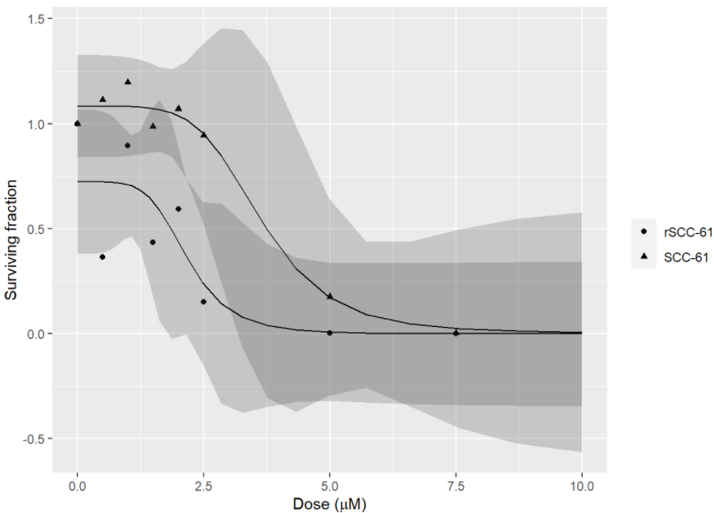
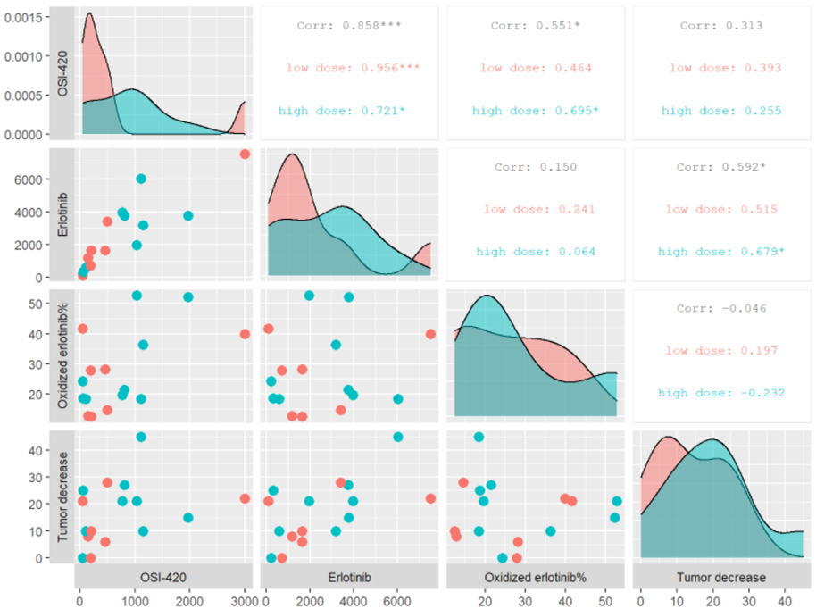
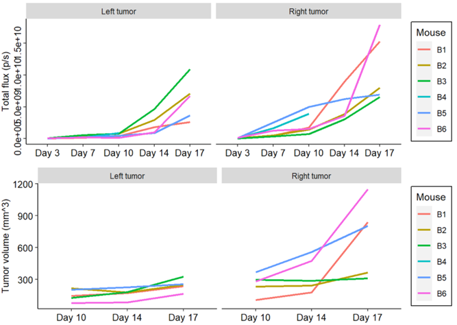
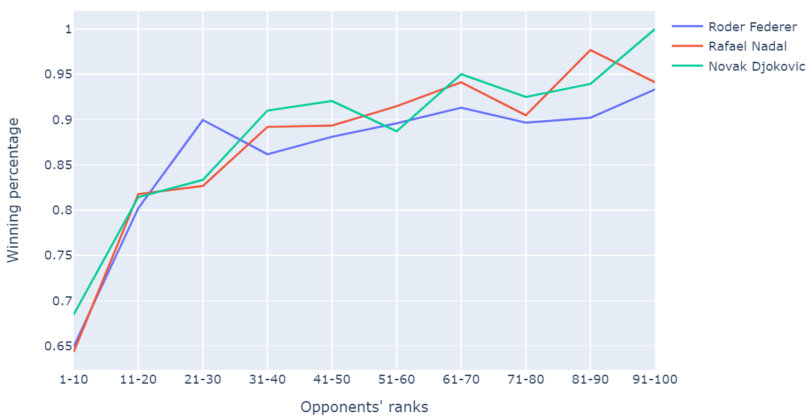

# Portfolio

---

### City Recommender

(<a href="https://youtu.be/mn9afg52erY" target="_blank">presentation</a>)(<a href="pdf/team032report.pdf" target="_blank">report</a>)
- Led a team of 6 to build a content-based interactive recommender system using weighted cosine similarity
- Scraped, merged, and cleaned ~30,000 US cities data with ~80 attributes from three different data sources
- Imputed missing values with k-nearest neighbors (KNN) and performed k-means clustering to evaluate data quality

---

### House price prediction

(<a href="pdf/house_report.pdf" target="_blank">report</a>)
- Scraped and cleaned ~1,000 local house price data from Zillow.com
- Built regularized linear regression (Lasso and Ridge) and random forest regression models to predict sales prices
- Performed feature engineering using natural language processing (NLP) and improved prediction mean squared error by 9%

---

### Non-linear regression curve fitting

- Used four parameter logistic to study a dose-response curve and calculate the IC50/ED50/EC50 dose (<a href="projects/drc_4PL.html" target="_blank">R</a>)
- Used linear-quadratic and multi-target to model cell survival curve after radiation (<a href="projects/nls_lq_mt.html" target="_blank">R</a> &#124; <a href="projects/curve_fit_lq_mt.html" target="_blank">python</a>)
- Used exponential decay increasing to the max to fit a (pseudo) first-order reaction (<a href="projects/nls_exponential_decay_increasing_to_max.html" target="_blank">R</a> &#124; <a href="projects/curve_fit_exponential_decay_increasing_to_max.html" target="_blank">python</a>)

---

### Correlation analysis

(<a href="projects/correlation_analysis.html" target="_blank">slides</a>)
- Analyzed correlations between redox-related metabolites in head and neck cancer patients and their responses to a cancer treatment
- Built a multiple linear regression model using the forward selection based on adjusted R2 method

---

### Mouse tumor growth trend analysis

- Recorded and graphed mouse xenograft tumor growth trend (<a href="projects/mouse_tumor_r.html" target="_blank">R</a> &#124; <a href="projects/mouse_tumor_py.html" target="_blank">python</a>)

---

### ATP Tennis Analytics

(<a href="https://www.kaggle.com/iamanalien/atp-tennis-2000-2020-initial-analysis" target="_blank">kaggle notebook</a>)
- Analyzed over 63,000 men’s professional tennis matches from 2000 to 2020
- Examined the statistics on upset rate and the impact of winning the first set on the whole match
- Created interactive visualizations for top players’ ranking and performance comparisons

### Notes
- <a href="projects/tree_notes.html" target="_blank">regression tree &#124; random forest regression &#124; logistic regression notes</a>
- <a href="projects/pca_notes.html" target="_blank">PCA &#124; PCR notes</a>
- <a href="projects/stepwise_notes.html" target="_blank">stepwise &#124; lasso &#124; elastic net &#124; ridge regression notes</a>
